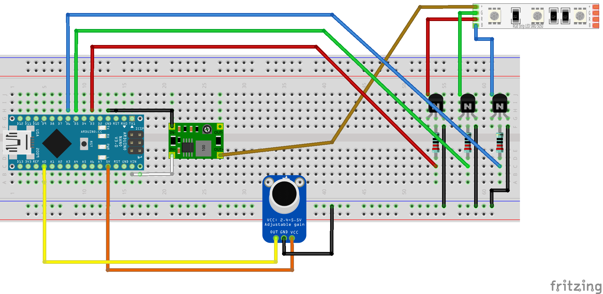

# IndoorVoice

I am that loud talker in the office (and at home). This project is designed to let me know
visually that I'm being too loud without my coworkers (and family) having to politely tell
me to shut my pie-hole. At regular talking levels, it should flash green, when getting
louder it'll turn blue then violet, and if I'm being _waay_ too loud, it'll flash red.

## Circuit Diagram

