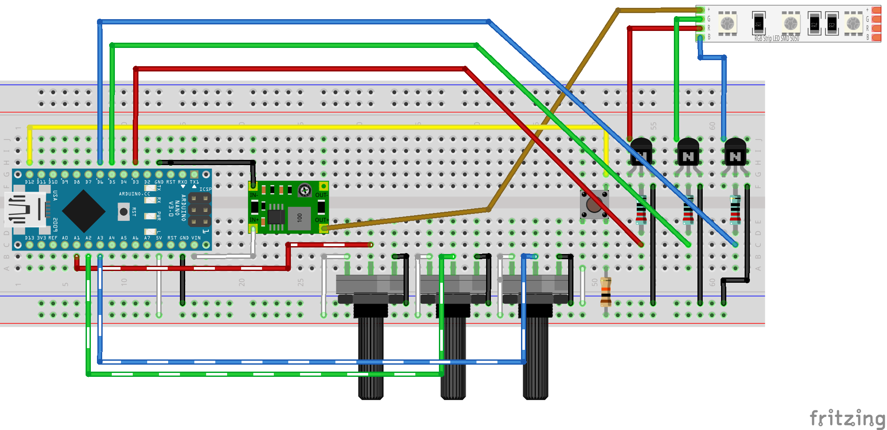

# ShardIllumination
Code for illuminating "shards" of acrylic glass

## The Circuit

The purpose of this project is to provide illumination for a piece of engraved
and / or milled acrylic glass. This illumination is provided by a non-addressable
LED strip embedded in a channel in a wooden base on top of which the shard
rests.

The color of the light either cycles through a preset pattern (in "demo" mode)
or is set via three potentiometer knobs providing analog input (the reason I
chose an Arduino Nano over an ESP8266 was that the ESP8266 only has a single
analog input, and I wasn't up to multiplexing). Switching between "demo" mode
and controlled-color mode is enabled via a tactile push button.

As the light strip requires 12V DC and the Arduino uses 5V logic, the circuit
includes a step up board to power the light strip. My board has a Micro USB
jack, which is significantly more convenient to use than the Mini USB plug
on the Arduino Nano.

I use simple NPN transistors to control power to the individual RGB channels,
using PWM (analog write) signals from the Nano to vary brightness.

## Parts List
  * 1x Arduino Nano
  * 3x 220Ω resistors
  * 1x 10kΩ resistor
  * 3x 10kΩ linear rotary potentiometers
  * 1x tactile push button
  * 3x 2N2222 NPN BJTs
  * 1x MT3608 boost converter
  * 1x short (3 light) strip of SMD 5050 RGB LEDs

## Demos
Coming soon!