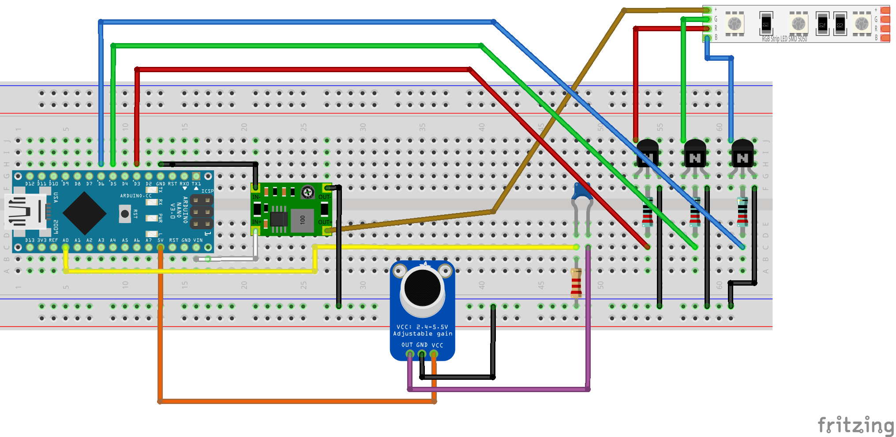

# ShardIllumination
Code for illuminating "shards" of acrylic glass.

This project contains several sketches that perform variations on lighting up RGB
LEDs (uniform color, as opposed to individually addressible). The variants provided
are:

- [DemoIllumination](DemoIllumination/DemoIllumination.ino), which cycles through a
  palette of nine colors in sequence
- [MappingTest](MappingTest/MappingTest.ino), for trying out a continuous color
  palette
- [TooShrill](TooShrill/TooShrill.ino): the most complex variant, where the illumination
  color and intensity is a function of an amplified microphone signal, sent through a
  high-pass filter.

## Circuit Diagram

This is the most complex variant of this project, with a USB boost converter powering
the circuit mainly because I wanted USB power but didn't want to use the mini USB port
in the Arduino Nano.

## Parts List
Coming soon!

### Design Files

## Installation
Several of these sketches rely on a common utility file. In order to include it, you'll
either need to add [`illumination_utils.h`](libraries/illumination_utils.h) to the sketch
folders and then change the `#include` line to use quotes instead of angle-brackets, or
move / symlink the header to a folder within your Arduino "libraries" folder.

## Operation
Coming soon!

## Demos
Coming soon!