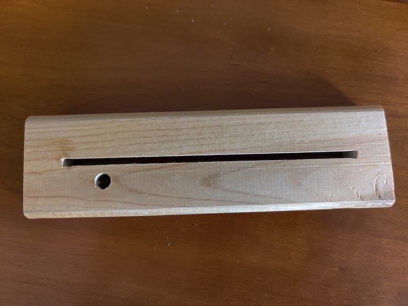
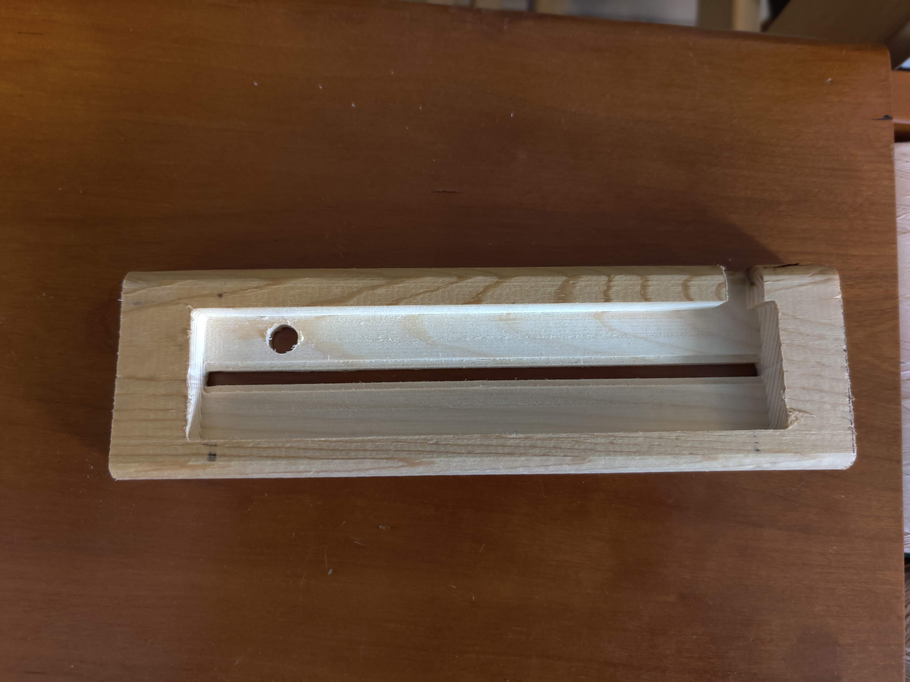

# Shard Stand CNC files

This folder contains both the [Easel](https://easel.inventables.com/) project and the
exported G-Code I used to build the acrylic glass holder. It was designed to hold an un-cut
piece of [this acrylic glass](https://www.amazon.com/gp/product/B07ZPZQZM3), which is
manufactured by the same folks who made my CNC. The underside is hollowed out to hold all
the electronics, with a cut-out for a USB cable to provide power.

